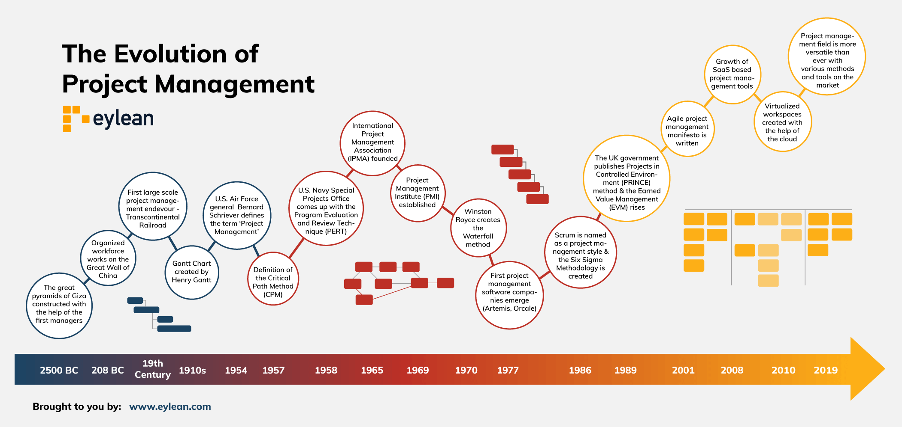

# Readme

> Leading Change - John P. Kotter

> Change is inevitable, but it gets complicated as its size and interconnectedness increase. Inertia sets in overtime. Long-standing successful companies develop managers who keep the system stable instead of leaders. People lose sight of external dynamics changing the world around them. And, companies lose their competitiveness dramatically in this fast-changing world. It is changing because of the competition.
>
> The competition brings more demand from customers for quicker service, better products, and lower costs. You cannot offer quick service if your structure does not allow it. You cannot offer better products if you don't innovate and understand customers' needs better. You cannot lower the costs if you don't aggressively attack slow processes, constantly monitor them, and keep improving them over and over again.
>
> The question is no longer to ask whether to choose between low cost or high quality. It is to find a way for both low cost and high quality. We also cannot choose between affordable products or well-paid employees. We need well-paid qualified employees to develop low-cost products.
>
> But how can we change the years of complacency that is built into the core of the company? This book answers that with 8 stage change process. The glue factor among all these stages is creating awareness for a need to change and developing the mechanics of pushing the change through. Things are changing, and they are changing fast. Thereby we change too and change fast.
>
> The 8 stage change process:
>
> 1. Establishing a sense of urgency
> 2. Creating the guiding coalition
> 3. Developing a vision and strategy
> 4. Communicating the change vision
> 5. Empowering employees for broad-based action
> 6. Generating short-term wins
> 7. Consolidating gains and producing more change
> 8. Anchoring new approaches in the culture
>
> We need people who do possess both leadership and managerial skills who can shake up inertia and complacency, develop and communicate vision and bring everyone on the same page, be aware of external dynamics, drive people forward while keeping budget in mind, developing long-term processes, and keep things working stable after the change.
>
> When it comes to urgency, it should not be confused with panic. It is the reaction to the realization of changing odds against the success of the company. The good news is that if you are still employed and the company is still making revenue, then there is still time not to panic. However, change takes time; hence, the urgency.

Projects represent a means of implementing strategies



### Need




### Assessement




### Strategy




### Project




### Change




Corporate Live cycle

<figure><figcaption></figcaption></figure>

Project management evolution

<figure><figcaption></figcaption></figure>

Project management focus

<figure><figcaption></figcaption></figure>

<figure><figcaption></figcaption></figure>

Project management definitions

<table data-view="cards"><thead><tr><th></th><th></th><th></th><th></th><th></th></tr></thead><tbody><tr><td>Project</td><td>Temporary</td><td>Developed progressively</td><td>Generates a unique result, product or service</td><td>Transform the business</td></tr><tr><td>Operation</td><td>Continous effort</td><td>Repetititve</td><td>Maintain business activity</td><td>Mantain the business</td></tr></tbody></table>

The OK Go project

Project Management Definitions

Projects are part of a broader ecosystem

<figure><figcaption></figcaption></figure>

<figure><figcaption></figcaption></figure>

Project manager

<figure><figcaption></figcaption></figure>

<figure><figcaption></figcaption></figure>

Project Management – Approaches&#x20;

Project Phase– A collection of logically related project activities that culminates in the completion of one or more deliverables.&#x20;

Project Life Cycles – The series of phases that a project passes through from is initiation to its closure. Project Life Cycles can be categorized as being predictive, iterative and adaptive.&#x20;

Product Life Cycle – Collection of generally sequential, non-overlapping product phases whose name and number represent the evolution of a product, from concept through delivery, growth, maturity, and to retirement.

<figure><figcaption></figcaption></figure>

Product Life cycle

<figure><figcaption></figcaption></figure>

Project life cycle

<figure><figcaption></figcaption></figure>

<figure><figcaption></figcaption></figure>

<figure><figcaption></figcaption></figure>

<figure><figcaption></figcaption></figure>

<figure><figcaption></figcaption></figure>

Aproaches

<figure><figcaption></figcaption></figure>

Project management - Approaches

<figure><figcaption></figcaption></figure>

<figure><figcaption></figcaption></figure>

<figure><figcaption></figcaption></figure>

<figure><figcaption></figcaption></figure>

