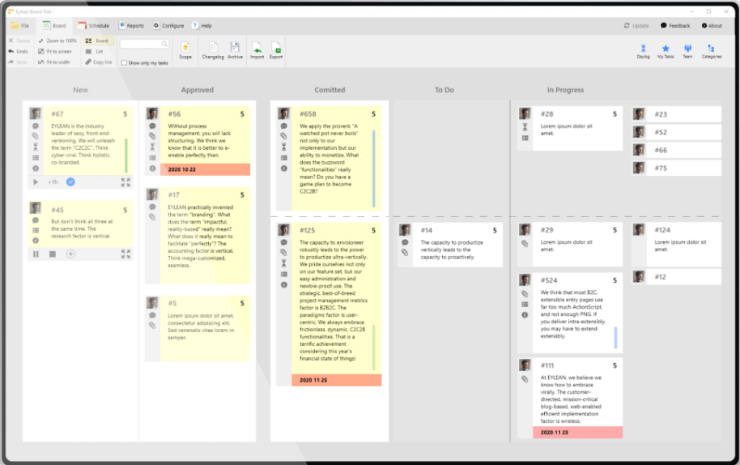

# Brief project management history

While today most of us are familiar with the term ‘Project Management,’ only a little over a century ago, the situation was quite different. Humanity has been working, and finishing projects since the very beginning, but ever since the industrial revolution, the way we work has significantly changed. And that brought a new need for organization and management. Curious to see how we got from there to here? Check out our short project management history.

While it all started with large projects such as the Great Pyramids of Giza, the Great Wall of China, and the Transcontinental Railroad, we step into what project management is today with Henry Gantt and the Gantt Chart in the 1910s. It was and to many still is the quintessential tool of project management that changed the way we perform and manage all of our tasks. After this, it took almost another 50 years for Bernard Schriever to coin the term ‘Project management’ in 1954, and from then on, we got moving.

<figure><figcaption></figcaption></figure>

#### The traditional Project Management

* 1957 marked the creation of the [**Critical Path Method (CPM)**](https://web.archive.org/web/20230327071910/https://yourbusiness.azcentral.com/history-critical-path-method-24351.html) by a pair of mathematicians James Kelley and Morgan Walker at DuPont Company. They were looking to avoid the costs of plant shutdowns and restarts caused by inefficient scheduling. By focusing efforts on performing the right tasks at the right times, instead of flooding the problem with labor to stay on the schedule they managed to avoid 25 percent of the shutdowns.
* Following CPM in the 1958 Program Evaluation and Review Technique (PERT) was established for the U.S. Navy Special Projects Office. Created primarily to simplify the planning and scheduling of large and complex projects, it focused on finding out the time needed to complete each task and the minimum time needed to complete the whole project.
* 1965 marked the founding of the [**International Project Management Association (IPMA)**](https://web.archive.org/web/20230327071910/https://www.ipma.world/about-us/ipma-international/history-of-ipma/). It started as a way for Pierre Koch of France, Dick Vullinghs from the Netherlands, and Roland Gutsch from Germany to discuss the benefits of the Critical Path Method (CPM) as a management approach. And to this day IPMA is promoting competence throughout society to enable a world in which all projects succeed.
* A similar meeting took place in 1969 resulting in the founding of the [**Project Management Institute (PMI)**](https://web.archive.org/web/20230327071910/https://www.pmi.org/about/learn-about-pmi/founders) in Pennsylvania, USA. Jim Snyder and Gordon Davis sat down for dinner and agreed to form a new organization. PMI was created to help managers associate, share information and discuss problems.
* 1970 brought [**the Waterfall method**](https://web.archive.org/web/20230327071910/https://en.wikipedia.org/wiki/Waterfall_model) by Winston W. Royce. Instead of looking at the project as a whole, it was divided into stages that should be completed one after another. Only when one phase is finished and verified, another one can be begun.
* The **first** [**project management software**](https://web.archive.org/web/20230327071910/http://www.eylean.com/) **was developed** in 1977 due to the rapid growth of computer technology. Among the first names are Oracle and Artemis. Now the market is full of various tools like [Eylean Board](https://web.archive.org/web/20230327071910/https://www.eylean.com/).

<figure><figcaption></figcaption></figure>

#### The New Project Management Approach

* 1986 marked the year where the term [**Scrum**](https://web.archive.org/web/20230327071910/https://medium.com/@warren2lynch/the-brief-of-history-of-scrum-15efb73b4701) has been introduced. Hirotaka Takeuchi and Ikujiro Nonaka published the article, [“New New Product Development Game.”](https://web.archive.org/web/20230327071910/https://cb.hbsp.harvard.edu/cbmp/product/86116-PDF-ENG) In which they described a new approach to commercial product development that would increase speed and flexibility. The inspiration came from case studies at manufacturing firms in the automotive, photocopier, and printer industries and marked a new page in project management history.
* In 1989 PROMPT II was adopted as a U.K. Government standard for I.T. project management and called [**PRINCE**](https://web.archive.org/web/20230327071910/https://en.wikipedia.org/wiki/PRINCE2). It has since been taken in many countries and evolved into PRINCE II. The main idea – dividing a project into small and manageable pieces remains the same.
* The year 2001 marked the writing of the Agile manifesto. The four values and 12 principles guided many Agile applications and still stand as an excellent means of eliminating waste.
* With the growth of the cloud, 2008 marked the year we were introduced into **SaaS Project management** tools. Allowing teams and managers to collaborate even if they are not located in the same building. This collaboration gave great flexibility and eased the stress of not co-located teams.
* In 2010 the cloud was pushed even further with **fully virtualized workspaces**. It allows for teams to not only use the project management software away from the main office but to perform their tasks anywhere adequately.

_As we enter 2020, we see the most excellent range and possibilities for project managers throughout the project management history. There are various methods, tools, and approaches to choose from_ which to use. _And as the supply grows ever more significant, it is becoming more and more important to_ [_know how to select_](https://web.archive.org/web/20230327071910/https://www.eylean.com/blog/2018/10/choose-the-right-project-management-tool/) _the right project management solution._
